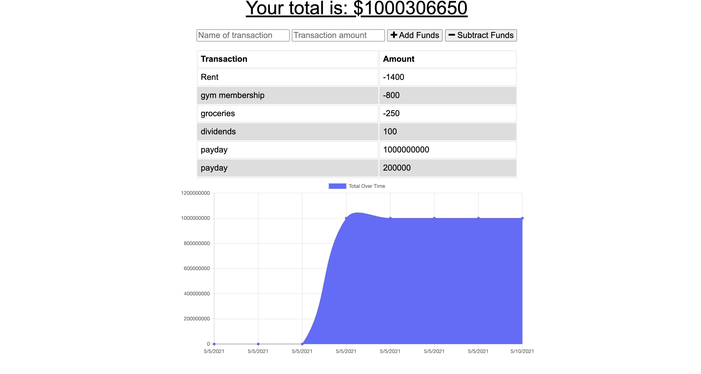

# budget-trackers

## Description

The user will be able to add expenses and deposits to their budget with or without a connection. When entering transactions offline, they should populate the total when brought back online.

Offline Functionality:

- Enter deposits offline

- Enter expenses offline

When brought back online:

- Offline entries should be added to tracker.

## Table of contents

- [Description](#description)
- [ScreenShot](#screenshot)
- [Heroku](#Heroku)
- [Installation](#installation)
- [Usage](#usage)
- [License](#license)
- [Questions](#questions)

## ScreenShot

## Heroku

https://budget-tracker-unit.herokuapp.com/

## Installation

To install necessary dependencies, run the following command:

npm install or npm i after you have cloned the repository

## Usage

npm start

## License

This project is licensed under the MIT license.

## Questions

If you have any questions about the repo, open an issue or contact me directly at keonakirby@gmail.com. You can find more of my work at https://github.com/Keonak
